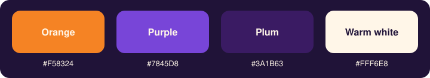
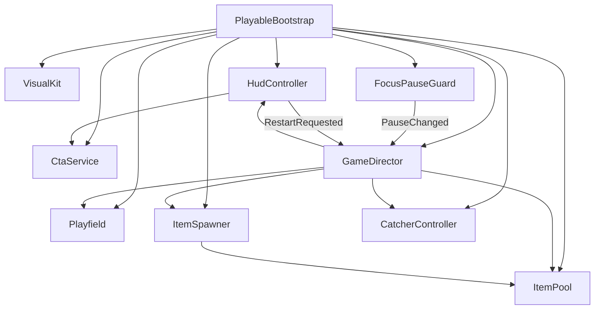

<p align="center">
  
</p>

<h1 align="center">Fox Catch</h1>

<p align="center">
  <strong>A warm, 18-second catcher playable</strong> that turns Scrambly’s fox into a tiny reward hunt —
  then invites the player to discover games and rewards on
  <a href="https://scrambly.io/">Scrambly</a>.
</p>

<p align="center">
  
  
  
  
</p>

<p align="center">
  
</p>

---

## Purpose

[Scrambly](https://scrambly.io/) is a rewards platform for discovering mobile games and apps, completing eligible activities, and redeeming rewards.

This repository is a **short playable ad**: an interactive sample that should feel fun in a few seconds and give the player a clear reason to explore Scrambly. It is not the full product. In-play scores and “rewards” are **simulated**. The playable never promises income, payouts, or a real balance.

The design brief asked for an original concept, mechanic, and visual treatment, using the supplied fox artwork as a starting point (not an official brand kit). The working palette is suggested by that reference.

## Proposal

**Catching falling rewards is the metaphor.** The fox already lives in Scrambly’s advertising world. Here it becomes the player: you drag it under a rain of coins, gems, and treats, the same way Scrambly is about spotting value and collecting it.

| Beat | What the player feels | What the playable is selling |
| --- | --- | --- |
| 0–3s | “Drag to catch” — instant agency | The fox is *your* character |
| Mid-round | Rain gets denser, score ticks up | Rewards are visible and collectible |
| 7s | Orange **Play on Scrambly** CTA | A door out to the real platform |
| 18s | End card: score, disclaimer, CTA + Restart | Reviewers can replay; claims stay honest |

The CTA is **local-only**. An explicit tap logs `CTA clicked` to the Unity log and the browser console, shows a toast, and does **not** navigate away. That keeps the playable review-safe inside an iframe.

<p align="center">
  
</p>

## The game

One round is **18 seconds**. There is no menu and no loading screen after boot — you are already playing.

1. **Drag** (mouse or a single finger) to move the fox along the lane.
2. **Catch** falling items with proximity, not physics. Distance to the fox’s snout plus each item’s radius is enough.
3. **Score** before the timer empties. Missed items vanish below the playfield.
4. **Restart** from the top bar at any time, or from the end card after the round.

HUD strokes that begin on a button do not steal the fox, so Restart and the CTA stay tappable.

### Collectibles

<p align="center">
  
  &nbsp;&nbsp;
  
  &nbsp;&nbsp;
  
</p>

| Item | Role | Points | Spawn weight |
| --- | --- | ---: | ---: |
| **Star coin** | Default rain, easy to read | 2 | 50 |
| **Puzzle gem** | Higher value, slightly smaller | 3 | 30 |
| **Treat** | Filler so the sky never looks empty | 1 | 20 |

Cadence and fall speed **ramp with the timer**: spawn interval goes from ~0.82s → 0.34s, fall speed from ~3.05 → 4.15 world units/s. The last seconds feel busier without a second difficulty system.

## Visual language

Warm orange against deep purple-ink, with cream type — a playable palette inspired by the fox reference, **not** an official Scrambly brand standard.

<p align="center">
  
</p>

| Token | Hex | Used for |
| --- | --- | --- |
| Orange | `#F58324` | Primary CTA, timer fill |
| Purple | `#7845D8` | Restart, gem accent |
| Deep ink | `#201338` | Camera clear, chrome |
| Warm white | `#FFF6E8` | HUD type |
| Plum | `#3A1B63` | Cards, score chip, meter track |

The playfield is an illustrated backdrop (platforms, puzzle pieces, plants). The fox, items, and background are crunch-compressed sprites (fox 256, items 128, backdrop max 512) so the WebGL zip stays well under **5 MB** (currently ~2.71 MB).

## Playable-ad constraints

Built as a **Unity WebGL** player meant to sit in a host page or iframe:

- **Portrait** 320×568 and 390×844, **landscape** 568×320 and 844×390. The playfield retargets FOV, camera height, and HUD scale on resize/orientation.
- Touch + mouse, **one pointer**. The template blocks page scroll, pinch-zoom, and context menu (`touch-action: none`, `devicePixelRatio: 1` so input matches the canvas).
- **Focus pause**: blur or `OnApplicationPause` freezes `timeScale` and audio. Resume uses a two-frame grace window so a huge `deltaTime` cannot skip the round.
- **Clean restart**: pool, spawner, catcher, score, and HUD reset without rebuilding the scene.
- **No PhysX, no TMP**: distance catch + legacy uGUI `Text`, so stripping can drop physics and TextMeshPro from the player.
- Brotli compression with decompression fallback, High managed stripping, IL2CPP Master + Optimize Size, Built-in Render Pipeline, unlit playable shaders.

## Architecture

Runtime composition is intentional: the committed scene stays almost empty. `PlayableBootstrap` wires services once, then `GameDirector` owns the round.



| Script | Role |
| --- | --- |
| `PlayableBootstrap` | Composition root: camera, EventSystem, world, fox, HUD |
| `GameDirector` | Timer, score, catch loop, end, restart |
| `CatcherController` | Pointer → Z=0 plane → smoothed X, facing flip |
| `Playfield` | Frustum bounds, spawn/kill Y, backdrop fit |
| `ItemSpawner` / `ItemPool` / `FallingItem` | Ramped rain, pooled billboards |
| `HudController` | Score chip, pill timer, mid CTA, end card, toast |
| `CtaService` / `BrowserConsole` | Local CTA + WebGL `console.log` |
| `FocusPauseGuard` / `PlayableTime` | Blur freeze without time jumps |
| `GameConfig` | Inspector-tweakable round numbers |

Designer knobs live on `My project/Assets/Settings/GameConfig.asset` (round length, mid-CTA time, weights, speeds, catch radius). Per-kind scale, radius, and score live on `VisualKit`.

## Repo layout

```
scramblycatcher/
├── docs/                          README captures + palette
├── My project/                    Unity project (2022.3.33f1)
│   ├── Assets/
│   │   ├── Art/                   Fox, items, backdrop, materials
│   │   ├── Scripts/               Gameplay, HUD, platform, presentation
│   │   ├── Settings/GameConfig.asset
│   │   ├── Shaders/               Playable/Unlit*
│   │   ├── WebGLTemplates/PlayableAd/
│   │   └── Scrambly-reference/    Assessment kit (fox + palette)
│   ├── Editor/                    Scene factory + WebGL builder
│   └── Tools/Serve-Playable.ps1   Local HttpListener, no CDN
└── .gitattributes                 Git LFS for png/webp and other binaries
```

`Library/`, `Builds/`, `Logs/`, and `UserSettings/` are gitignored. Rebuild the zip when you need a reviewer package.

## Build & play locally

**Editor:** Unity **2022.3.33f1**, open `My project/`. Menu **Playable → Build WebGL &lt; 5MB**. Output:

- `My project/Builds/WebGL/`
- `My project/Builds/FoxCatch-WebGL.zip` (must stay under 5 MB)

Batchmode:

```text
Unity.exe -batchmode -nographics -projectPath "My project" -executeMethod Scrambly.EditorTools.PlayableBuilder.BuildWebGL
```

**Serve without uploading anywhere** (from `My project/`):

```powershell
powershell -File Tools/Serve-Playable.ps1 -Port 8080
```

Then open `http://127.0.0.1:8080/`.

## Credits & disclaimer

- Fox treatment and working palette are derived from the assessment reference kit (Simula advertiser materials / suggested colors). Not an official Scrambly brand standard.
- Product: [scrambly.io](https://scrambly.io/).
- **Demo rewards are simulated.** This playable does not grant real Scrambly balance, cash, or guaranteed outcomes.

---

<p align="center"><em>Drag the fox. Catch the glow. Peek at Scrambly.</em></p>
